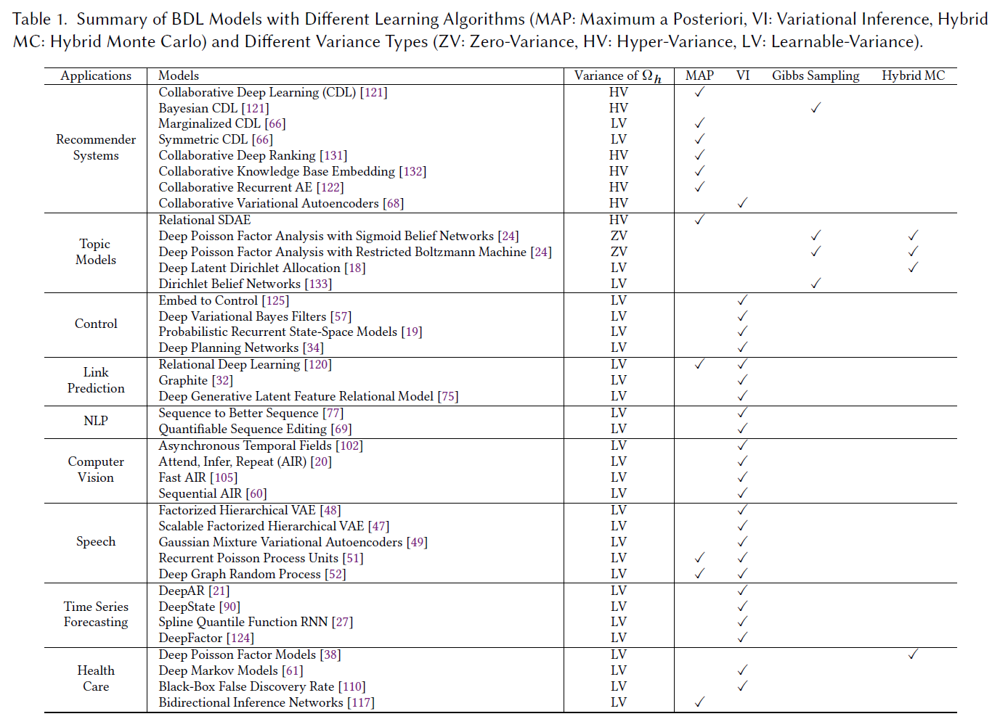

# An Updating Survey for Bayesian Deep Learning (BDL)

## Survey

A Survey on Bayesian Deep Learning 
by Wang et al., ACM Computing Surveys (CSUR) 2020 
[[PDF]](http://wanghao.in/paper/CSUR20_BDL.pdf) [[BDL Framework in 2016]](http://wanghao.in/paper/TKDE16_BDL.pdf)

## BDL and Recommender Systems

Collaborative Deep Learning for Recommender Systems 
by Wang et al., KDD 2015 
[[PDF]](http://wanghao.in/paper/KDD15_CDL.pdf) [[Project Page]](http://wanghao.in/CDL.htm) [[2014 Arxiv Version]](https://arxiv.org/abs/1409.2944)

Collaborative Recurrent Autoencoder: Recommend while Learning to Fill in the Blanks 
by Wang et al., NIPS 2016 
[[PDF]](https://arxiv.org/abs/1611.00454)

Collaborative Knowledge Base Embedding for Recommender Systems 
by Zhang et al., KDD 2016 
[[PDF]](https://dl.acm.org/citation.cfm?id=2939673)

Collaborative Deep Ranking: A Hybrid Pair-Wise Recommendation Algorithm with Implicit Feedback 
by Ying et al., PAKDD 2016 
[[PDF]](https://link.springer.com/chapter/10.1007/978-3-319-31750-2_44)

Collaborative Variational Autoencoder for Recommender Systems 
by Li et al., KDD 2017 
[[PDF]](https://www.kdd.org/kdd2017/papers/view/collaborative-variational-autoencoder-for-recommender-systems)

Variational Autoencoders for Collaborative Filtering 
by Liang et al., WWW 2018 
[[PDF]](https://arxiv.org/abs/1802.05814)

## BDL and Healthcare

Electronic Health Record Analysis via Deep Poisson Factor Models 
by Henao et al., JMLR 2016 
[[PDF]](http://www.jmlr.org/papers/volume17/15-429/15-429.pdf)

Structured Inference Networks for Nonlinear State Space Models 
by Krishnan et al., AAAI 2017 
[[PDF]](https://arxiv.org/pdf/1609.09869.pdf)

Black Box FDR 
by Tansey et al., ICML 2018 
[[PDF]](https://arxiv.org/abs/1806.03143)

Bidirectional Inference Networks: A Class of Deep Bayesian Networks for Health Profiling 
by Wang et al., AAAI 2019 
[[PDF]](https://arxiv.org/pdf/1902.02037)

Sampling-free Uncertainty Estimation in Gated Recurrent Units with Applications to Normative Modeling in Neuroimaging 
by Hwang et al., UAI 2019 
[[PDF]](http://auai.org/uai2019/proceedings/papers/296.pdf)

## BDL and NLP

Sequence to Better Sequence: Continuous Revision of Combinatorial Structures 
by Mueller et al., ICML 2017 
[[PDF]](http://proceedings.mlr.press/v70/mueller17a.html)

QuaSE: Sequence Editing under Quantifiable Guidance 
by Liao et al., EMNLP 2018 
[[PDF]](https://arxiv.org/pdf/1804.07007.pdf)

## BDL and Computer Vision
Attend, Infer, Repeat: Fast Scene Understanding with Generative Models 
by Eslami et al., NIPS 2016 
[[PDF]](https://arxiv.org/abs/1603.08575)

Efficient Inference in Occlusion-aware Generative Models of Images 
by Huang et al., ICLR 2016 
[[PDF]](https://arxiv.org/abs/1511.06362)

Sequential Attend, Infer, Repeat: Generative Modelling of Moving Objects 
by Kosiorek et al., NIPS 2018 
[[PDF]](https://arxiv.org/abs/1806.01794)

Spatially Invariant Unsupervised Object Detection with Convolutional Neural Networks 
by Crawford et al., AAAI 2019 
[[PDF]](https://www.aaai.org/ojs/index.php/AAAI/article/view/4216)

Faster Attend-Infer-Repeat with Tractable Probabilistic Models 
by Stelzner et al., ICML 2019 
[[PDF]](http://proceedings.mlr.press/v97/stelzner19a.html)

Asynchronous Temporal Fields for Action Recognition 
by Sigurdsson et al., CVPR 2017 
[[PDF]](https://arxiv.org/pdf/1612.06371.pdf)

Generalizing Eye Tracking with Bayesian Adversarial Learning 
by Wang et al., CVPR 2019 
[[PDF]](http://openaccess.thecvf.com/content_CVPR_2019/papers/Wang_Generalizing_Eye_Tracking_With_Bayesian_Adversarial_Learning_CVPR_2019_paper.pdf)

Sequential Neural Processes 
by Singh et al., NIPS 2019 
[[PDF]](http://papers.nips.cc/paper/9214-sequential-neural-processes.pdf)

## BDL and Control

Embed to Control: A Locally Linear Latent Dynamics Model for Control from Raw Images 
by Watter et al., NIPS 2015 
[[PDF]](https://arxiv.org/abs/1506.07365)

Deep Variational Bayes Filters: Unsupervised Learning of State Space Models from Raw Data 
by Karl et al., ICLR 2017 
[[PDF]](https://arxiv.org/pdf/1605.06432.pdf)

Probabilistic Recurrent State-Space Models 
by Doerr et al., ICML 2018 
[[PDF]](http://proceedings.mlr.press/v80/doerr18a/doerr18a.pdf)

Learning Latent Dynamics for Planning from Pixels 
by Hafner et al., ICML 2019 
[[PDF]](https://arxiv.org/pdf/1811.04551.pdf)

## BDL and Graphs (Link Prediction, Graph Neural Networks, etc.)

Relational Deep Learning: A Deep Latent Variable Model for Link Prediction 
by Wang et al., AAAI 2017 
[[PDF]](https://www.aaai.org/ocs/index.php/AAAI/AAAI17/paper/download/14346/14463)

Graphite: Iterative Generative Modeling of Graphs 
by Grover et al., ICML 2019 
[[PDF]](https://arxiv.org/pdf/1803.10459.pdf)

Relational Variational Autoencoder for Link Prediction with Multimedia Data 
by Li et al., ACM MM 2017 
[[PDF]](https://dl.acm.org/citation.cfm?id=3126774)

Stochastic Blockmodels meet Graph Neural Networks 
by Mehta et al., ICML 2019 
[[PDF]](https://arxiv.org/pdf/1905.05738.pdf)

## BDL and Topic Modeling

Relational Stacked Denoising Autoencoder for Tag Recommendation 
by Wang et al., AAAI 2015 
[[PDF]](https://www.aaai.org/ocs/index.php/AAAI/AAAI15/paper/download/9350/9980)

Scalable Deep Poisson Factor Analysis for Topic Modeling 
by Gan et al., ICML 2015 
[[PDF]](http://proceedings.mlr.press/v37/gan15.html)

Deep Latent Dirichlet Allocation with Topic-layer-adaptive Stochastic Gradient Riemannian MCMC 
by Cong et al., ICML 2017 
[[PDF]](https://dl.acm.org/citation.cfm?id=3305471)

Deep Unfolding for Topic Models 
by Chien et al., TPAMI 2017 
[[PDF]](https://ieeexplore.ieee.org/abstract/document/7869412/)

Neural Relational Topic Models for Scientific Article Analysis 
by Bai et al., CIKM 2018 
[[PDF]](https://dl.acm.org/citation.cfm?id=3271696)

Dirichlet Belief Networks for Topic Structure Learning 
by Zhao et al., NIPS 2018 
[[PDF]](http://papers.nips.cc/paper/8020-dirichlet-belief-networks-for-topic-structure-learning)

## BDL and Speech Recognition/Synthesis

Unsupervised Learning of Disentangled and Interpretable Representations from Sequential Data 
by Hsu et al., NIPS 2017 
[[PDF]](https://arxiv.org/pdf/1709.07902.pdf)

Scalable Factorized Hierarchical Variational Autoencoder Training 
by Hsu et al., Interspeech 2018 
[[PDF]](https://arxiv.org/pdf/1804.03201.pdf)

Hierarchical Generative Modeling for Controllable Speech Synthesis 
by Hsu et al., ICLR 2019 
[[PDF]](https://arxiv.org/pdf/1810.07217.pdf)

Recurrent Poisson Process Unit for Speech Recognition 
by Huang et al., AAAI 2019 
[[PDF]](https://pdfs.semanticscholar.org/4970/fa3189cd9a9c817ba72082e2f3d5fc9a7df1.pdf)

## BDL and Forecasting (Time Series Analysis)

DeepAR: Probabilistic Forecasting with Autoregressive Recurrent Networks 
by Salinas et al., 2017 
[[PDF]](https://arxiv.org/pdf/1704.04110.pdf)

Deep State Space Models for Time Series Forecasting 
by Rangapuram et al., NIPS 2018 
[[PDF]](https://papers.nips.cc/paper/8004-deep-state-space-models-for-time-series-forecasting.pdf)

Deep Factors for Forecasting 
by Wang et al., ICML 2019 
[[PDF]](https://arxiv.org/pdf/1905.12417.pdf)

Probabilistic Forecasting with Spline Quantile Function RNNs 
by Gasthaus et al., AISTATS 2019 
[[PDF]](http://proceedings.mlr.press/v89/gasthaus19a/gasthaus19a.pdf)

## BDL as a Framework (Miscellaneous)

Towards Bayesian Deep Learning: A Framework and Some Existing Methods 
by Wang et al., TKDE 2016 
[[PDF]](https://arxiv.org/abs/1608.06884)

Composing Graphical Models with Neural Networks for Structured Representations and Fast Inference 
by Johnson et al., NIPS 2016 
[[PDF]](https://arxiv.org/abs/1603.06277)

## Bayesian/Probabilistic Neural Networks as Building Blocks of BDL

Learning Stochastic Feedforward Networks 
by Neal et al., Technical Report 1990 
[[PDF]](https://www.cs.toronto.edu/~hinton/absps/sff.pdf)

A Practical Bayesian Framework for Backprop Networks 
by MacKay et al., Neural Computation 1992 
[[PDF]](https://pdfs.semanticscholar.org/b0f2/433c088591d265891231f1c22424047f1bc1.pdf)

Keeping Neural Networks Simple by Minimizing the Description Length of the Weights 
by Hinton et al., COLT 1993 
[[PDF]](http://citeseerx.ist.psu.edu/viewdoc/summary?doi=10.1.1.44.3435)

Practical Variational Inference for Neural Networks 
by Alex Graves, NIPS 2011 
[[PDF]](https://papers.nips.cc/paper/4329-practical-variational-inference-for-neural-networks)

Auto-Encoding Variational Bayes 
by Kingma et al., ArXiv 2014 
[[PDF]](https://arxiv.org/pdf/1312.6114.pdf)

Deep Exponential Families 
by Ranganath et al., AISTATS 2015 
[[PDF]](https://arxiv.org/abs/1411.2581)

Weight Uncertainty in Neural Networks 
by Blundell et al., ICML 2015 
[[PDF]](https://arxiv.org/abs/1505.05424)

Probabilistic Backpropagation for Scalable Learning of Bayesian Neural Networks 
by Hernandez-Lobato et al., ICML 2015 
[[PDF]](http://proceedings.mlr.press/v37/hernandez-lobatoc15.pdf)

Variational Dropout and the Local Reparameterization Trick 
by Kingma et al., NIPS 2015 
[[PDF]](https://arxiv.org/pdf/1506.02557.pdf)

The Poisson Gamma Belief Network 
by Zhou et al., NIPS 2015 
[[PDF]](http://papers.nips.cc/paper/5645-the-poisson-gamma-belief-network)

Deep Poisson Factor Modeling 
by Henao et al., NIPS 2015 
[[PDF]](http://papers.nips.cc/paper/5786-deep-poisson-factor-modeling)

Natural-Parameter Networks: A Class of Probabilistic Neural Networks 
by Wang et al., NIPS 2016 
[[PDF]](http://wanghao.in/paper/NIPS16_NPN.pdf) [[Project Page]](https://github.com/js05212/NPN) [[Code]](https://github.com/js05212/NPN)

Adversarial Variational Bayes: Unifying Variational Autoencoders and Generative Adversarial Networks 
by Mescheder et al., ICML 2017 
[[PDF]](https://arxiv.org/pdf/1701.04722.pdf)

Stick-Breaking Variational Autoencoders 
by Nalisnick et al., ICLR 2017 
[[PDF]](https://openreview.net/forum?id=S1jmAotxg)

Bayesian GAN 
by Saatchi et al, NIPS 2017 
[[PDF]](https://arxiv.org/abs/1705.09558)

Lightweight Probabilistic Deep Networks 
by Gast et al., CVPR 2018 
[[PDF]](http://openaccess.thecvf.com/content_cvpr_2018/html/Gast_Lightweight_Probabilistic_Deep_CVPR_2018_paper.html)

Feed-forward Propagation in Probabilistic Neural Networks with Categorical and Max Layers 
by Shekhovtsov et al., ICLR 2018 
[[PDF]](https://openreview.net/forum?id=SkMuPjRcKQ)

Glow: Generative Flow with Invertible 1x1 Convolutions 
by Kingma et al., NIPS 2018 
[[PDF]](https://papers.nips.cc/paper/8224-glow-generative-flow-with-invertible-1x1-convolutions.pdf)

ProbGAN: Towards Probabilistic GAN with Theoretical Guarantees 
by He et al., ICLR 2019 
[[PDF]](http://wanghao.in/paper/ICLR19_ProbGAN.pdf) [[Project Page]](https://github.com/hehaodele/ProbGAN)

Sampling-free Epistemic Uncertainty Estimation Using Approximated Variance Propagation 
by Postels et al., ICCV 2019 
[[PDF]](https://arxiv.org/abs/1908.00598)

